# Plan de acción por fases - Dailys Agencia X

Plan estructurado en fases secuenciales. Cada fase tiene entregables concretos y criterios de cierre. Las fases posteriores dependen de la estabilidad de las anteriores.

---

## Fase 0: Correcciones críticas (1-2 semanas)

**Objetivo**: Resolver bugs que afectan uso diario y consistencia post-migración.

| #   | Tarea                                    | Archivos                      | Entregable                                              |
| --- | ---------------------------------------- | ----------------------------- | ------------------------------------------------------- |
| 0.1 | Redirección automática en `/user`        | App.tsx                       | Index route que redirija a `/user/projects/all`         |
| 0.2 | Listar proyectos en UserSidebar          | UserSidebar.tsx               | Renderizar proyectos asignados como enlaces             |
| 0.3 | Añadir `restricted_access` a Project     | models/Project.ts, migración   | Campo en modelo y script de migración                   |
| 0.4 | Migrar `daily_work_statistics`           | lib/metrics.ts                | Implementar como agregación MongoDB o query equivalente |
| 0.5 | Unificar sistema de toasts               | App.tsx, Management.tsx, etc. | Un solo sistema (Sonner o react-hot-toast)              |
| 0.6 | Validar permisos en `/user/projects/all` | UserProjectView.tsx           | Filtrar por `assigned_projects` cuando corresponda      |

**Criterio de cierre**: Usuario puede entrar, ver sus proyectos y trabajar sin pantallas vacías ni errores de métricas.

---

## Fase 1: Seguridad y fundamentos (2-3 semanas)

**Objetivo**: Eliminar riesgos de seguridad y sentar bases técnicas sólidas.

| #   | Tarea                             | Archivos                                 | Entregable                                                          |
| --- | --------------------------------- | ---------------------------------------- | ------------------------------------------------------------------- |
| 1.1 | Contraseñas con bcrypt            | api/auth.ts, models/User.ts, AuthContext | Endpoints `/api/auth/login` y `/api/auth/register`; hash en backend |
| 1.2 | Validación de API                 | api/db.ts, lib/db/                        | Zod para QueryRequest; `express.json({ limit })`                    |
| 1.3 | Validación de formularios         | Login, Register, Users                    | Email regex, longitud mínima contraseña, mensajes de error claros   |
| 1.4 | Optimizar migración con bulkWrite | scripts/migrate-supabase-to-mongodb.ts    | Migración 5-10x más rápida                                          |
| 1.5 | Optimizar upsert con bulkWrite    | lib/db/queryExecutor.ts                    | Menos round-trips en task_work_assignments                          |

**Criterio de cierre**: Login/registro seguros; API validada; migración y upserts optimizados.

---

## Fase 2: Experiencia de usuario y consistencia (2 semanas)

**Objetivo**: Mejorar UX y coherencia del producto.

| #   | Tarea                        | Archivos                   | Entregable                                                  |
| --- | ---------------------------- | -------------------------- | ----------------------------------------------------------- |
| 2.1 | Vista "Mi día"               | Nueva página, UserLayout   | Resumen de tareas asignadas hoy, todos los proyectos        |
| 2.2 | Redirección user a "Mi día"  | Home, App                  | User tras login va a vista Mi día en lugar de `/user` vacío |
| 2.3 | Breadcrumbs                  | Componente Layout, páginas | Navegación contextual en Admin y User                       |
| 2.4 | Completar UserSidebar        | UserSidebar.tsx            | Enlaces a proyectos individuales + "Mi día" + "Todos"       |
| 2.5 | Code splitting               | App.tsx                    | Lazy loading de rutas; bundle inicial más pequeño           |
| 2.6 | Componente Loading unificado | src/components/            | Spinner/skeleton reutilizable                               |

**Criterio de cierre**: Usuario encuentra rápido su trabajo; navegación clara; carga inicial más rápida.

---

## Fase 3: Reportes y análisis (1-2 semanas)

**Objetivo**: Reportes útiles para gestión y cierre de mes.

| #   | Tarea                                        | Archivos                    | Entregable                                                 |
| --- | -------------------------------------------- | --------------------------- | ---------------------------------------------------------- |
| 3.1 | Filtros por período en reportes              | Reports.tsx, lib/metrics.ts | Selector: semana, mes, último mes, rango personalizado     |
| 3.2 | Exportar horas para facturar                 | Reports, lib/metrics         | CSV/PDF por cliente o proyecto con horas y opcional tarifa |
| 3.3 | Reemplazar o eliminar getDailyWorkStatistics | lib/metrics.ts              | Implementación MongoDB o deprecación si no se usa          |
| 3.4 | Caché para app_settings                      | api/telegram, lib/          | TTL corto para reducir consultas                           |

**Criterio de cierre**: Admin puede generar reportes por período y exportar datos para facturación.

---

## Fase 4: Entidad Cliente y facturación (2-3 semanas)

**Objetivo**: Base para facturación y reportes por cliente.

| #   | Tarea                                    | Archivos                    | Entregable                                       |
| --- | ---------------------------------------- | --------------------------- | ------------------------------------------------ |
| 4.1 | Modelo Cliente                           | models/Client.ts            | id, name, contact, email, hourly_rate (opcional) |
| 4.2 | Relación Project -> Client               | models/Project.ts           | client_id en Project                             |
| 4.3 | CRUD de clientes                         | Nueva página Clients, rutas | Crear, editar, listar clientes                   |
| 4.4 | Asignar cliente al crear/editar proyecto | Projects.tsx                | Selector de cliente                              |
| 4.5 | Reportes por cliente                     | Reports, metrics            | Métricas y exportación por cliente               |
| 4.6 | Campo facturable en tarea                | models/Task.ts, Subtask     | Flag para excluir de facturación (ej. reuniones)  |

**Criterio de cierre**: Proyectos vinculados a clientes; reportes y exportación por cliente.

---

## Fase 5: Presupuesto y control financiero (1-2 semanas)

**Objetivo**: Control de horas y costes por proyecto.

| #   | Tarea                                | Archivos               | Entregable                              |
| --- | ------------------------------------ | ---------------------- | --------------------------------------- |
| 5.1 | Presupuesto en proyecto              | models/Project.ts      | budget_hours o budget_amount             |
| 5.2 | Indicador de presupuesto en Projects | Projects.tsx           | % consumido (80%, 100%, 120%)           |
| 5.3 | Alerta en Dashboard                  | Dashboard.tsx          | Proyectos sobre o cerca del presupuesto  |
| 5.4 | Notificación Telegram de presupuesto | api/telegram, cron/job | Alerta configurable al superar umbral   |

**Criterio de cierre**: Admin ve desvíos de presupuesto y puede actuar a tiempo.

---

## Fase 6: Eficiencia operativa (2-3 semanas)

**Objetivo**: Reducir trabajo repetitivo y mejorar asignación.

| #   | Tarea                        | Archivos                            | Entregable                                                |
| --- | ---------------------------- | ----------------------------------- | --------------------------------------------------------- |
| 6.1 | Plantillas de proyectos      | models/ProjectTemplate.ts, Projects | Crear plantilla desde proyecto; "Usar plantilla" al crear |
| 6.2 | Recordatorios de vencimiento | api/telegram, job/cron              | Notificación X días antes del deadline (configurable)     |
| 6.3 | Resumen diario por Telegram  | api/telegram                        | "Tienes N tareas que vencen hoy" (opcional)               |
| 6.4 | Vista de capacidad           | Nueva página o sección              | Horas asignadas vs disponibles por persona/semana        |
| 6.5 | Búsqueda en Management/Tasks | Management.tsx, Tasks.tsx           | Buscar por título, proyecto, asignado                     |

**Criterio de cierre**: Proyectos repetitivos más rápidos; menos tareas vencidas; mejor asignación.

---

## Fase 7: Roles y escalabilidad (2 semanas)

**Objetivo**: Delegar sin dar acceso total.

| #   | Tarea                        | Archivos                    | Entregable                                                    |
| --- | ---------------------------- | --------------------------- | ------------------------------------------------------------- |
| 7.1 | Rol Project Manager          | models/User.ts, AuthContext | Nuevo role: `pm`                                              |
| 7.2 | Permisos PM                  | AdminRoute, rutas           | PM: management, projects, tasks, reports (solo sus proyectos) |
| 7.3 | Asignación de PM a proyectos | Projects, models            | project_id -> pm_id o similar                                 |
| 7.4 | Vista de revisión para PM    | Management                  | Cola de tareas pendientes de aprobar para sus proyectos       |

**Criterio de cierre**: PM puede gestionar sus proyectos sin acceso a usuarios ni configuración global.

---

## Fase 8: Colaboración y trazabilidad (2-3 semanas)

**Objetivo**: Mejor comunicación y auditoría.

| #   | Tarea                            | Archivos                       | Entregable                                            |
| --- | -------------------------------- | ------------------------------ | ----------------------------------------------------- |
| 8.1 | Comentarios en tareas            | models/TaskComment.ts, UI      | Hilo de comentarios por tarea/subtarea                |
| 8.2 | Historial de cambios (auditoría) | models/AuditLog.ts, middleware | Log de reasignaciones, cambios de deadline, etc.      |
| 8.3 | Vista de auditoría (admin)       | Nueva página                   | Filtros por usuario, fecha, acción                    |
| 8.4 | Objetivo y cierre de proyecto    | models/Project.ts, Projects    | Campo objetivo; checklist de cierre; estado "cerrado"   |

**Criterio de cierre**: Comunicación en contexto; trazabilidad de cambios; cierre formal de proyectos.

---

## Fase 9: Evolución avanzada (3+ semanas)

**Objetivo**: Funcionalidades de mayor valor y complejidad.

| #   | Tarea                            | Archivos                              | Entregable                                            |
| --- | -------------------------------- | ------------------------------------- | ----------------------------------------------------- |
| 9.1 | Archivos adjuntos                | Almacenamiento (S3/local), models, UI | Adjuntar archivos a tareas; límite de tamaño          |
| 9.2 | Múltiples aprobadores            | models, Management                    | Revisores por proyecto/área; cola por revisor         |
| 9.3 | Recuperar contraseña             | api/auth, Login                       | Flujo "¿Olvidaste tu contraseña?" con token por email |
| 9.4 | Configuración de horas laborales | app_settings, Reports                 | Horas/día por usuario o global                        |
| 9.5 | Etiquetas en tareas              | models, UI                            | Tags opcionales; filtros por tag                      |

**Criterio de cierre**: Adjuntos disponibles; aprobaciones distribuidas; recuperación de contraseña operativa.

---

## Resumen de fases

```mermaid
flowchart LR
    F0[Fase 0: Correcciones] --> F1[Fase 1: Seguridad]
    F1 --> F2[Fase 2: UX]
    F2 --> F3[Fase 3: Reportes]
    F3 --> F4[Fase 4: Cliente]
    F4 --> F5[Fase 5: Presupuesto]
    F5 --> F6[Fase 6: Eficiencia]
    F6 --> F7[Fase 7: Roles]
    F7 --> F8[Fase 8: Colaboración]
    F8 --> F9[Fase 9: Evolución]
```

| Fase | Duración estimada | Enfoque                                     |
| ---- | ----------------- | ------------------------------------------- |
| 0    | 1-2 semanas       | Bugs críticos                               |
| 1    | 2-3 semanas       | Seguridad y base técnica                    |
| 2    | 2 semanas         | UX y consistencia                           |
| 3    | 1-2 semanas       | Reportes y facturación básica               |
| 4    | 2-3 semanas       | Cliente y facturación                        |
| 5    | 1-2 semanas       | Presupuesto                                 |
| 6    | 2-3 semanas       | Plantillas, recordatorios, capacidad         |
| 7    | 2 semanas         | Rol PM                                      |
| 8    | 2-3 semanas       | Comentarios, auditoría, cierre              |
| 9    | 3+ semanas        | Adjuntos, aprobadores, recuperar contraseña |
